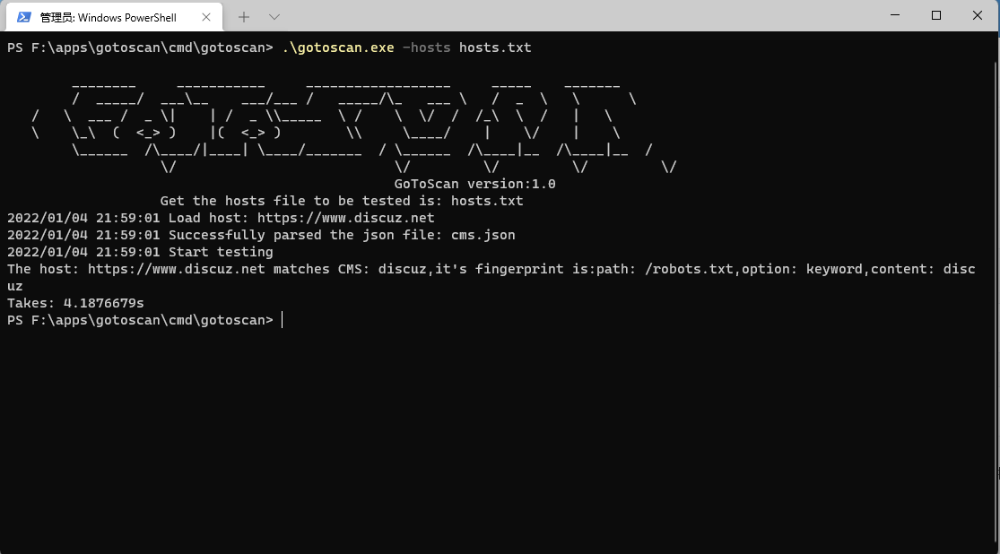

# gotoscan

### 简介

由Go语言实现的一款CMS指纹识别工具。

### 使用方法

```
gotoscan.exe -host https://localhost.com 
gotoscan.exe -hosts hosts.txt
```

##### 编译命令

```
go build -ldflags "-s -w" -trimpath
```

##### 参数

```
  -cmsjson string
       指定CMS指纹特征json文件，默认为当前目录下的cms.json文件
  -host string
        测试一个目标，需要在域名前加上https或者http
  -hosts string
        指定测试多个目标存放的txt文件，一行一个目标
```

### 运行截图



